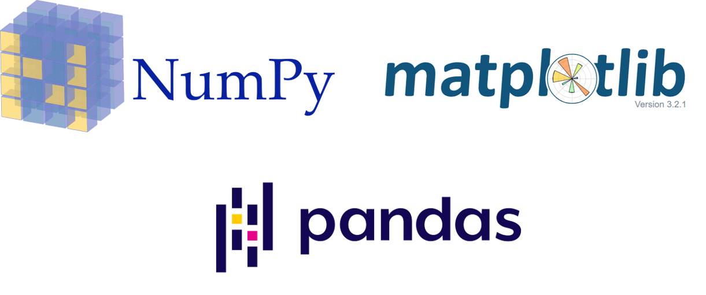

# Assignment 02 #
> Numpy, Matplotlib, Pandas

아래의 링크에 첨부된 과제를 수행한 후 <hai.studygroup@gmail.com> 으로  
**제목** : [2주차 과제] 성함_학번 과제 제출합니다.
로 보내주시면 됩니다.

## Assignment ##
`hw02_ml_package.ipynb`
이번 시간에는 데이터 사이언스 분야를 비롯한 여러 분야에서 범용적으로 쓰일 수 있는 라이브러리 3개(Numpy, Matplotlib, Pandas)의 핵심적인 부분을 학습하였습니다.
각각의 소문제들을 풀며 사용법을 익혀보아요!
Colab Link: [여기를 클릭하시오](https://colab.research.google.com/github/HanyangTechAI/2021-HAI-Assignment/blob/main/Lec02_Numpy_Matplotlib_Pandas/hw02_numpy_matplotlib_pandas.ipynb)  

> 제출시에는 Notebook 안의 빈칸의 내용을 복붙하여 `hai2021_hw02_이름_학번.py` 로 제출해주시면 됩니다.
