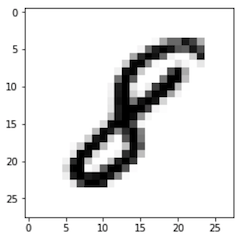

# Assignment 06 #
> Convolutional Neural Network with MNIST Dataset

아래 과제를 수행하여 <hai.studygroup@gmail.com> 으로  
**제목** : [6주차 과제] 성함_학번 과제 제출합니다.
로 보내주시면 됩니다.

## Assignment ##
`hw06_CNN.ipynb` 
MNIST에 CNN 적용해보아요
Colab Link: [여기를 클릭하시오](https://colab.research.google.com/github/HanyangTechAI/2021-HAI-Assignment/blob/main/Lec06_CNN/hw06_CNN.ipynb)  

> 제출시에는 Notebook 안의 빈칸의 내용을 복붙하여 `hai2021_hw06_이름_학번.py` 로 제출해주시면 됩니다.

